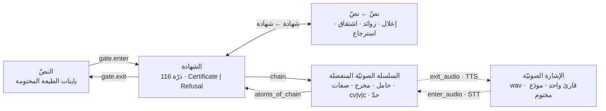

# دليل فريق الصوتيات — SLGE

2026-10-08 · صالح الغانم · نسخةٌ مودَعة من المستند المشترك (Claude Docs) بالمحتوى نفسه.

الصوتُ طبقةٌ فوق شهادة البوّابة لا بديلٌ عنها: TTS مخرجٌ ثانٍ للشهادة، وSTT مدخلٌ ثانٍ إليها، وما لا يصل إلى شهادةٍ يُرفض باسمه ولا يُخمَّن.

## ١. الغرض والنطاق

مهمّةُ الفريق بناءُ مدخلٍ صوتيٍّ ومخرجٍ صوتيٍّ لشهادة الغانم، بحيث يصير النصُّ والصوتُ وجهين لثابتٍ واحد هو الشهادة (116 ذرّة: 29 حاملًا × 4 حالات). الهدفُ البعيد ثلاثة: نصّ → صوت (TTS)، صوت → نصّ (STT)، ونصّ → نصّ (قائمٌ عبر الشهادة: إعلال، زوائد، اشتقاق، استرجاع).

**داخل النطاق**

- السلسلةُ الصوتيّة المنفصلة من الشهادة (حامل، مخرج، صفات، دورٌ مقطعيّ، سياقُ حدّ) — وهي ما يُبرهَن.
- مودَعٌ صوتيٌّ مختوم بقارئٍ واحد ورخصةٍ صريحة، ومرجعُ محاذاةٍ محجوبٌ يُقاس عليه.
- مفكّكٌ لـSTT لا يبحث إلّا في السلاسل المرخَّصة، ومركِّبٌ لـTTS لا يرى إلّا سلسلةَ شهادة.

**خارج النطاق (يُرفض باسمه، لا يُؤجَّل بصمت)**

- أيّ قراءةٍ للنصّ خارج `gate.enter`، وأيّ كتابةٍ له خارج `gate.exit`.
- أيّ رقمٍ عن الإشارة الصوتيّة بلا مرجعٍ محجوب، وأيّ وسمِ «مبرهن» لما يمسّ الإشارة.
- التجويدُ أداءً (أزمنةُ المدّ، الإمالة، الروم، الإشمام) حتى يُودَع له مصدرٌ مختوم؛ إلى ذلك الحين «معلَن» باسمه.
- اللهجات، والقرّاء المتعدّدون، والنصوص غير المشكولة — خارج المجال المعلَن الأوّل.

## ٢. القانون الملزم

القانونُ الواحد يحكم هذا الفريق كما يحكم المستودعات كلَّها: **لا يدخل نصٌّ ولا يخرج إلّا عبر بوّابة الغانم وبرهانها** (`gate.enter(bytes) → Certificate | Refusal`، `gate.exit(cert) → bytes`). الصوتُ يأخذ التوقيعَ نفسَه: `enter_audio(wav) → Certificate | Refusal` و`exit_audio(cert) → wav`. ودستورُ الوكيل (`AGENT_CONSTITUTION.md`، 17 مادّة) ملزمٌ لكلّ عضوٍ وكلّ وكيلٍ آليّ.

**الوسوم الستّة** — كلُّ جملةٍ في وثيقةٍ أو تقريرٍ تحمل وسمًا واحدًا، ولا يُرفع وسمٌ فوق سنده:

| الوسم | شرطُه | مثالٌ من طبقة الصوت |
| --- | --- | --- |
| مبرهن | مبرهنةٌ في Lean باسمها، مسلّماتُها `propext`/`Classical.choice`/`Quot.sound` فقط | استرجاعُ الذرّات من السلسلة الصوتيّة بعينها |
| مطابَق | جدولُ Lean المولَّد يساوي مرآةَ بايثون سطرًا سطرًا | مكعّبُ الخلايا 348 |
| مفحوص | اختبارٌ باسمه توقّعاتُه مستقلّةٌ عن الشيفرة ومطعَّمةٌ بالطفرة (20/20) | طفراتُ الحامل الحلقيّ تُرفض |
| مقيس | رقمٌ على مرجعٍ بشريٍّ محجوب لم يره النموذج | WER على عيّنة المحاذاة المحجوبة |
| معلَن | قاعدةٌ أو بيانٌ مكتوبٌ بمصدره، بلا برهانٍ ولا قياس | أزمنةُ المدّ 2/4/6 |
| رأي | استنتاجُ العضو، يُكتب بصيغة الرأي | «المفكّكُ سيفيد من الحدّ الثلاثيّ» |

**القواعد السبع التي لا تُناقَش**

1. لا كلامَ عن ملفٍّ أو رقمٍ أو نتيجةٍ قبل إثبات وجودها («لا ثقة بلا طبعة»).
2. كلُّ تقريرٍ يفصل ثلاثةً بعناوينها: ما فحصته الآلة، ما استنتجه العضو، ما بقي باسمه.
3. لا رقمَ منشورٌ بلا مولِّدٍ مسمًّى يعيد حسابَه (`CLAIMS.md`؛ المخالفةُ `NUMBER_WITHOUT_GENERATOR`).
4. لا خليّةَ ولا جدولَ يُملأ باليد؛ ما يُولَّد يُولَّد، وما يُدقَّق بشريًّا يُسجَّل بتاريخه ومدقِّقه.
5. ما لا يُعرف يُرفض باسمه ولا يُخمَّن ولا «يُسند إلى الفصحى» ولا يُملأ من الذاكرة.
6. لا مودَعَ جديد ولا مرجعَ ولا دمجَ في `main` بلا إذن صاحب المستودع (المادّة ٩)؛ ولا حذفَ — تعليقٌ بسجلّ.
7. الخطأُ يُقرّ به باسمه أوّلًا ثمّ يُصلَح من المصدر المختوم لا من الذاكرة (المادّة ٧)، ويُسجَّل في ADR.

## ٣. إطار العمل



الخطُّ المتّصل مبرهنٌ في Lean (منفصل)، والمنقّطُ مقيسٌ على مرجعٍ محجوب (إشارة). كلُّ ما داخل المربّع المنفصل (نصّ، شهادة، سلسلة) يُبرهَن في Lean؛ وما يمسّ الإشارة يُقاس فقط. الترخيصُ المتدرّج: كلُّ طبقةٍ تأخذ مخرجَ التي تحتها ولا تزيد عليه تخمينًا، وترفض باسمها ما لا ترخّصه.

| الطبقة | المدخل → المخرج | أعلى وسمٍ ممكن | الحال | المعالِم |
| --- | --- | --- | --- | --- |
| 0 البوّابة | بايتات → شهادة → بايتات بعينها | مبرهن | قائم (`formal/a116`) | `Fiber.decode_encode`، `Boundary`، `Hadd`، `Residue` |
| 1 السلسلة الصوتيّة | شهادة → `List Phone` → شهادة بعينها | مبرهن + مطابَق | التالي (بلا إذنٍ جديد) | `chain`، `atoms_of_chain`، مكعّب 348 خليّة، `no_initial_sukun` |
| 2 المودَع الصوتيّ | تسجيلات + محاذاة بشريّة → مختومٌ ومحجوب | مقيس (لا Lean) | بإذن المالك | `manifest.DEPOSITS`، بصمة، رخصة، عيّنة محجوبة مجمّدة |
| 3 STT | wav → احتمالات → بحثٌ في المرخَّص → شهادة → رسم بـ`exit` | مبرهن للمفكّك المجرّد، مقيس للنموذج | بعد اخضرار 2 | `decode_sound`، `decode_complete`، WER/PER على المحجوب |
| 4 TTS | شهادة → `chain` → wav | مبرهن للمدخل، مقيس للدورة | بعد اخضرار 2 | `enter_audio(exit_audio c) = c` نسبةً، MOS |
| 5 نصّ → نصّ | شهادة → شهادة | مبرهن | قائم ويمتدّ | `Slge.Ilal`، `Slge.Zawaid`، `gate.derive/recover` |

## ٤. الأدوار والمسؤوليّات

أربعةُ أدوارٍ متمايزة، ولا يجتمع الإيداعُ والتدقيقُ والقياسُ في شخصٍ واحد على المودَع نفسه (فصلُ الواجبات كما في مراجعة الأقران). الوكيلُ الآليّ يعمل تحت الأدوار نفسها ولا يأخذ صلاحيّةً ليست لعضوٍ بشريّ.

| الدور | يفعل | لا يفعل | مخرجُه الموثَّق |
| --- | --- | --- | --- |
| صاحب المستودع | يأذن بالمودَع الجديد والمرجع المحجوب والدمج في `main` والمجال المعلَن | لا يُستبدل بإذنه تقديرُ أحد | ADR بتاريخ الإذن |
| المودِع (data steward) | يختم التسجيلات والنصّ والرخصة، يكتب بطاقةَ المودَع، يسجّل البصمة في `manifest.DEPOSITS` | لا يعدّل مختومًا؛ التصحيح إصدارٌ جديد ببصمةٍ جديدة | بطاقة مودَع + بصمة |
| المدقّق الصوتيّ (annotator) | يحاذي ويراجع وفق البروتوكول (الباب ٦) باسمه وتاريخه | لا يرى مخرجَ النموذج على العيّنة التي يدقّقها؛ لا يدقّق وحده | ملفّ محاذاة + سجلّ تحكيم |
| المبرهِن (Lean) | يكتب الطبقة المنفصلة ومبرهناتها وجداولها المولَّدة ومرآتها | لا يكتب `sorry` ولا `native_decide`؛ لا يسمّي مبرهَنًا ما لم يدخل `Audit.lean` | مبرهنة باسمها + سطر في `axioms.txt` |
| القائس (evaluator) | يُجري التجربة المسجَّلة مسبقًا على المحجوب ويكتب التقرير بمولِّده | لا يلمس العيّنة المحجوبة قبل التجميد؛ لا ينشر رقمًا بلا فاصلة ثقة | سجلّ تجربة + سطر في `CLAIMS.md` |
| المراجع (reviewer) | يراجع كلّ طلب دمج: الوسوم، المولِّدات، الحارس، الطفرات | لا يراجع عملَه | مراجعة مكتوبة على الطلب |

## ٥. إدارة المودَعات

المودَعُ بايتاتٌ مختومةٌ لا تقرؤها شيفرةٌ إلّا أداةُ إيداعٍ معفاة تولّد جدولًا وتفحصه بـ`--check` — القاعدةُ نفسُها التي عليها الكتابُ والمخصّصُ ومقاييسُ اللغة الآن.

**الختم** — لكلّ مودَع `Deposit(path, kind, note, sha256, licence)` في `manifest.DEPOSITS`؛ البصمة SHA-256 للملفّ بعينه، و`tests/test_seals.py` يفحصها في CI. تغييرُ بايتٍ واحد = مودَعٌ جديد بإصدارٍ جديد وADR.

**المودَع الصوتيّ (الطبقة 2)** — شروطُ القبول، ولا يُقبل مودَعٌ ينقصه واحد:

1. قارئٌ واحد مسمًّى، روايةٌ واحدة مسمّاة، وطبعةُ النصّ هي المختومة نفسُها (`CORPUS_SHA256`).
2. رخصةٌ صريحة نصًّا (مثل CC BY أو CC BY-NC-SA أو إذنٌ مكتوب من القارئ) تُحفظ مع المودَع؛ «موقعٌ مفتوح» ليس رخصة.
3. صيغةٌ واحدة: WAV PCM 16-bit، 16 kHz، أحاديّ، بلا ضغطٍ فاقد؛ الأصلُ المضغوط يُحفظ ببصمته ويُسجَّل أمرُ التحويل حرفيًّا.
4. ملفٌّ لكلّ آية، اسمُه `{سورة:3}{آية:3}.wav`، وجدولُ بصمات واحد للمجموعة كلّها.
5. بطاقةُ مودَع (النموذج أ) مكتملةٌ قبل أوّل استعمال.

**المرجع المحجوب** — عيّنةٌ تُسحب عشوائيًّا ببذرةٍ مسجَّلة من المودَع قبل أيّ نموذج، تُحاذى بشريًّا (الباب ٦)، وتُجمَّد ببصمةٍ وتاريخ. لا يراها نموذجٌ ولا مطوّرٌ أثناء التدريب، وتُقاس عليها النتائج مرّةً لكلّ إصدار. التقسيمُ المعتاد: تدريب / تطوير / محجوب، ولا تتشارك الأقسامُ سورةً واحدة لمنع التسرّب.

**الإصدار والتسمية** — `audio-{القارئ}-{الرواية}-v{N}` للمودَع، `align-{المودَع}-heldout-v{N}` للمرجع، والرقمُ يزيد ولا يُعاد استعماله. النماذجُ المدرّبة مودَعاتٌ كذلك: أوزانٌ ببصمة وبطاقة نموذج (النموذج ب) والمودَعاتُ التي تدرّب عليها ببصماتها.

## ٦. بروتوكول التوثيق الصوتيّ (المحاذاة)

المحاذاةُ ربطُ كلّ خانةٍ من الشهادة بزمنٍ في الإشارة؛ وحدتُها الخانةُ (حامل، حالة) لا الحرفُ ولا المقطع، لأنّ الشهادةَ خانات. النصُّ الذي يُحاذى هو مخرج `gate.exit` للشهادة، لا نسخةٌ منقولةٌ باليد.

**الطبقات الثلاث لكلّ ملفّ** (Praat TextGrid أو ما يُصدَّر إليه):

| الطبقة | الوحدة | العلامة | المصدر |
| --- | --- | --- | --- |
| `word` | الكلمة كما تخرج من البوّابة | رقمُ الكلمة في الآية + رسمُها | آليٌّ من الشهادة |
| `cell` | الخانة (حامل، حالة) | فهرسُ الخانة 0–115 | آليٌّ من الشهادة، زمنُها بشريّ |
| `note` | ظاهرةُ أداء | وسمٌ من قائمةٍ مغلقة (مدّ، غنّة، قلقلة، وقف، سكت) | بشريّ، معلَن |

**الخطوات**

1. محاذاةٌ آليّة أوّليّة (محاذٍ قسريّ مسمًّى بإصداره) → تُحفظ كما هي باسم `auto`، ولا تُسمّى مرجعًا.
2. تدقيقٌ بشريٌّ مستقلٌّ من مدقّقين اثنين لا يرى أحدهما عملَ الآخر، كلٌّ باسمه وتاريخه في الملفّ.
3. قياسُ الاتّفاق: للحدود الزمنيّة متوسّطُ الفرق المطلق ونسبةُ الحدود ضمن 20 ms؛ للوسوم المغلقة كابا كوهين (κ). الحدُّ المعلَن للقبول: κ ≥ 0.80 و≥ 90% من الحدود ضمن 20 ms؛ ما دونه يُعاد التدريبُ على البروتوكول لا تُخفَّض العتبة.
4. تحكيمٌ لكلّ خلاف من محكّمٍ ثالث، والقرارُ مسجَّل بسببه في سجلّ التحكيم؛ لا «متوسّط» بين توقيتين بلا قرار.
5. التجميد: الملفّ المحكَّم يُختم ببصمةٍ ويُسجَّل في `DEPOSITS`؛ أيّ تصحيحٍ لاحق إصدارٌ جديد.

**ما لا يُفعل**

- لا تُصلَح الشهادةُ لتوافق السماع؛ الفرقُ بين المسموع والشهادة يُسجَّل في طبقة `note` باسمه (مثل `PERFORMANCE_DIVERGES`) ويُرفع للمالك.
- لا يُحاذى ما رفضته البوّابة (الـ 38 رفضًا في المودَع الحاليّ تبقى بلا زمن باسم رفضها).
- لا يُستعمل مخرجُ نموذجٍ يُقاس لاحقًا كمسوّدةٍ للعيّنة المحجوبة التي سيُقاس عليها.

## ٧. بروتوكول التجارب والقياس

كلُّ تجربةٍ تُسجَّل قبل أن تُجرى (pre-registration): السؤال، المقياس، العيّنة، عتبةُ النجاح، والبذرة — ثمّ تُجرى مرّةً على المحجوب ويُنشر رقمُها كما خرج. التجربةُ التي تتغيّر عتبتُها بعد النتيجة مرفوضةٌ باسم `THRESHOLD_MOVED_AFTER_RESULT`.

**المقاييس المعتمدة**

| الطبقة | المقياس | التعريف | المرجع |
| --- | --- | --- | --- |
| STT — النصّ | CER، WER | مسافةُ التحرير على مخرج `gate.exit` مقابل الطبعة المختومة، بايتاتٍ بعينها | المحجوب |
| STT — الخانات | PER (خطأ الخانة) | مسافةُ التحرير على ذرّات الشهادة (0–115) | المحجوب |
| STT — الرفض | نسبةُ الرفض باسمه | كم ملفًّا لم يبلغ شهادة، موزَّعًا على أسماء الرفض | المحجوب |
| TTS — الدورة | نسبةُ الردّ | `enter_audio(exit_audio c) = c` على عيّنة الشهادات | المحجوب |
| TTS — الجودة | MOS (ITU-T P.800) أو عبر الحشد (P.808) | ≥ 20 مستمعًا، عشوائيّةُ الترتيب، مع مرجعٍ بشريّ ومرساةٍ متدنّية | المحجوب |
| المحاذاة | دقّةُ الحدود | نسبةُ الحدود ضمن 20 ms من المحكَّم | المحجوب |

**قواعدُ الإبلاغ**

1. كلُّ رقمٍ مع فاصلة ثقة 95% (bootstrap على الملفّات، ≥ 1,000 إعادة) وحجمُ العيّنة وبذرتُها.
2. كلُّ رقمٍ له مولِّدٌ مسمًّى (`tools/gen_*_index.py::measure`) يعيد حسابَه من المودَعات ببصماتها، ويدخل `CLAIMS.md`.
3. المقارنةُ بين نموذجين على العيّنة نفسها والبذرة نفسها، والفرقُ يُبلَّغ بفاصلته؛ «أفضل» بلا فاصلة رأي.
4. النتيجةُ السلبيّة تُنشر كما تُنشر الإيجابيّة؛ لا تُحذف تجربةٌ مسجَّلة.
5. التكرارُ شرط: البيئة (إصدارات، عتاد)، الأمرُ الحرفيّ، وبصماتُ المدخلات في سجلّ التجربة (النموذج ج)؛ من لا يستطيع إعادةَ الرقم من السجلّ وحده لا ينشره.
6. العيّنةُ المحجوبة تُقاس عليها كلُّ إصدارٍ مرّةً واحدة؛ الضبطُ على عيّنة التطوير فقط.

## ٨. طريقة التوثيق

ستُّ وثائقَ لا غير، كلٌّ بموضعها ومولِّدها؛ ما يُولَّد يُفحص بـ`--check` في CI، وما يُكتب باليد يُراجَع في طلب الدمج. اللغةُ العربيّة، والمعرّفاتُ وأسماءُ المبرهنات والرفض باللاتينيّة كما هي في الشيفرة.

| الوثيقة | متى | الموضع | التسمية | يُولَّد؟ |
| --- | --- | --- | --- | --- |
| بطاقة مودَع (datasheet) | مع كلّ مودَعٍ أو مرجع | `docs/deposits/` | `{اسم المودَع}.md` | باليد، والبصمةُ تُفحص |
| بطاقة نموذج (model card) | مع كلّ أوزانٍ تُودع | `docs/models/` | `{الطبقة}-{الاسم}-v{N}.md` | باليد، والأرقامُ من المولِّد |
| سجلّ تجربة | قبل كلّ تجربة وبعدها | `docs/experiments/` | `{تاريخ}-{السؤال}.md` | التسجيلُ باليد، النتيجةُ من المولِّد |
| بطاقة خليّة | لكلّ خليّة في مكعّب 348 | `HALQ_INDEX.md` / `PHON_INDEX.md` | صفٌّ في جدول مولَّد | نعم، كلّيًّا |
| ADR | كلّ قرارٍ أو إذنٍ أو خطأٍ مُقرٍّ به | `ARCHITECTURE.md` (مرقّم) | `## N. ADR — العنوان (التاريخ)` | باليد |
| تقرير قياس | كلّ إصدار | `*_INDEX.md` + سطر في `CLAIMS.md` | باسم الفهرس | نعم، كلّيًّا |

**الوسم داخل الوثيقة** — كلُّ جملةٍ تحمل دعوى تُختم بوسمها وسندها بين قوسين: «الاسترجاعُ بعينه (مبرهن، `Phon.atoms_of_chain`)»، «WER 4.1% ± 0.6 (مقيس، `gen_stt_index.py::measure`، align-v1)»، «المدُّ ستُّ حركات (معلَن، بلا مصدرٍ مختوم)». جملةٌ بلا وسم تُعاد في المراجعة.

**التسمية والإصدار** — المعرّفاتُ باللاتينيّة الصغيرة والشرطة السفليّة (`halq_table`، `enter_audio`)؛ أسماءُ الرفض بالكبيرة (`NO_INITIAL_SUKUN`)؛ الإصدارُ رقمٌ يزيد ولا يُعاد؛ التاريخُ ISO (2026-10-08)؛ الكلماتُ العربيّة في الوثائق تُكتب كما تخرج من `gate.exit` بشكلها الكامل، لا منقولةً من موقع.

**المعجم** — كلُّ مصطلحٍ جديد يُضاف إلى `GLOSSARY.md` بموضع تعريفه قبل أوّل استعمالٍ له في وثيقة؛ المولِّد يُسقط البناء على مصطلحٍ بلا مدخل (`TERM_WITHOUT_ENTRY`) أو مدخلٍ بلا استعمال.

## ٩. النماذج

تُنسخ كما هي وتُملأ؛ حقلٌ لا يُعرف يُكتب فيه `غير معروف — <السبب>` ولا يُحذف ولا يُخمَّن. البطاقتان أ وب على نسق «Datasheets for Datasets» و«Model Cards» مطوَّعًا لقانوننا.

**أ. بطاقة مودَع**

```markdown
# بطاقة مودَع — audio-{القارئ}-{الرواية}-v1
النوع: صوت | محاذاة | أوزان
المصدر: <الجهة، الرابط، تاريخ الجلب>
الرخصة: <النصّ الحرفيّ أو مسار ملفّ الإذن>
القارئ / الرواية: <اسمٌ واحد> / <روايةٌ واحدة>
طبعة النصّ: corpora/quran-simple-enhanced.txt — CORPUS_SHA256 = <...>
الصيغة: WAV PCM16 · 16 kHz · أحاديّ · ملفّ/آية
الحجم: <عدد الملفّات> ملفًّا · <المدّة الكلّيّة> · <البايتات>
البصمة (جدول SHA-256 للمجموعة): <sha256 للجدول>
أمر التحويل الحرفيّ: ffmpeg -i in.mp3 -ac 1 -ar 16000 -sample_fmt s16 out.wav
التقسيم: تدريب <N> | تطوير <N> | محجوب <N> — بذرة <seed> — بلا سورة مشتركة
ما ليس فيه (باسمه): <آيات ناقصة، ضجيج، قطع>
المودِع / التاريخ: <الاسم> / <ISO>
ADR الإذن: <رقم ADR>
```

**ب. بطاقة نموذج**

```markdown
# بطاقة نموذج — stt-acoustic-v1
الطبقة: 3 (STT: إشارة → احتمالات أصوات)
المدخل / المخرج: wav 16 kHz / احتمالات على <عدد> صوتًا من Phon.chain
البنية والحجم: <نوع الشبكة، عدد المعاملات>
مودَعات التدريب (ببصماتها): audio-...-v1 <sha> · align-...-v1 <sha>
بصمة الأوزان: <sha256> · البذرة: <seed> · الأمر الحرفيّ: <...>
البيئة: <إصدار الإطار، العتاد، المدّة>
القياس على المحجوب (مرّة واحدة): PER <x% ± y> · WER <..> · رفض <n> باسمه
المولِّد: tools/gen_stt_index.py::measure · سطر CLAIMS.md: <البصمة>
الاستعمال المقصود / غير المقصود: قارئ واحد مسمًّى / أيّ متكلّم آخر، أيّ نصّ خارج المجال
الحدود المعروفة (باسمها): <...>
الوسم: مقيس — لا شيء في هذه البطاقة مبرهن
```

**ج. سجلّ تجربة (يُكتب النصفُ الأوّل قبل التشغيل ويُثبَّت بـcommit)**

```markdown
# تجربة — 2026-11-03 — هل يخفض قيدُ الحدّ (Hadd) خطأَ الخانة؟
## قبل التشغيل (commit <hash>)
السؤال: ...
الفرضيّة المسجَّلة: PER مع القيد < PER بدونه بفارق ≥ 0.5 نقطة
المقياس والعيّنة: PER · align-...-heldout-v1 (<sha>) · بذرة <seed>
المقارَن به: stt-acoustic-v1 بلا قيد (بصمة <sha>)
عتبة النجاح: فاصلة الفرق 95% لا تشمل الصفر
## بعد التشغيل
النتيجة (من المولِّد): <رقم ± فاصلة> · المولِّد: <أداة::measure> · بصمة المخرج: <...>
الحكم: نجحت | فشلت | غير حاسمة — لا تُغيَّر العتبة
ما فحصته الآلة / ما استنتجه العضو / ما بقي باسمه
```

**د. بطاقة خليّة (صفٌّ مولَّد — لا يُكتب باليد؛ هذا شكلُه)**

```markdown
| الحامل | الحالة | السياق | المخرج (سيبويه) | صورٌ في المودَع | شاهدٌ أوّل (خانات) | زمنٌ محكَّم | الحال |
| ع | ضم | ابتداء | أوسط الحلق | 44 | عُذْرًا | — | بلا زمن بعد |
| ح | سكون | ابتداء | أوسط الحلق | 0 | — | — | NO_INITIAL_SUKUN (مبرهن) |
```

**هـ. ADR**

```markdown
## N. ADR — <العنوان> (<إذن المالك إن وُجد>، <التاريخ>)
**السبب.** ما الذي دفع إلى القرار، بشاهده.
**القرار.** ما الذي نُفِّذ بالضبط (أدوات، ملفّات، مبرهنات).
**ما وُجد.** النتائج بأرقامها ومولِّداتها.
**ما ضُبط أثناء العمل.** الأخطاء باسمها وتصحيحها من المصدر.
**ما بقي باسمه.** الديون وشرط عودتها.
```

**و. تقرير قياس (خلاصةُ الفهرس المولَّد)**

```markdown
# فهرس <الطبقة> — مولَّد بـtools/gen_<x>_index.py؛ لا يُحرَّر باليد
المودَعات المقروءة (ببصماتها): ...
المبرهَن (بأسمائه في Audit.lean): ...
المطابَق (اختبار المطابقة): ...
المقيس على المحجوب: <رقم ± فاصلة، N، بذرة، إصدار المرجع>
المعلَن بلا مصدر: ...
ما ليس هنا — باسمه: ...
```

## ١٠. الرفضُ المسمّى في طبقة الصوت

كلُّ توقّفٍ له اسمٌ واحد ويُحصى باسمه؛ الأسماءُ التسعةُ الأولى موروثةٌ من البوّابة والباقيةُ تُسجَّل في `GLOSSARY.md` عند أوّل تنفيذ. رفضٌ بلا اسمٍ في القائمة خطأٌ يُسقط البناء.

| الاسم | متى | الطبقة |
| --- | --- | --- |
| `DEFER` / `REJECT` / `OUTSIDE_DECLARED_DOMAIN` | رفضُ البوّابة للنصّ نفسه | 0 |
| `START_VOWEL_OF_WASL_IS_UNKNOWN` | همزةُ وصل بلا سابق | 0 |
| `CVVC_NOT_GEMINATE` / `CVVC_ACROSS_WORD_BOUNDARY` / `JUNCTION_NOT_LICENSED` | قيدُ الحدّ والوصل | 0، 3 |
| `NO_INITIAL_SUKUN` | خليّةٌ في المكعّب فارغةٌ بالبرهان | 1 |
| `DEPOSIT_UNLICENSED` | مودَعٌ بلا رخصةٍ نصًّا | 2 |
| `DEPOSIT_UNSEALED` / `DEPOSIT_DRIFTED` | ملفٌّ بلا بصمة أو بصمتُه لا تطابق | 2 |
| `HELDOUT_TOUCHED` | العيّنةُ المحجوبة قُرئت قبل التجميد أو أثناء التدريب | 2–4 |
| `AGREEMENT_BELOW_THRESHOLD` | κ < 0.80 أو الحدود دون 90% ضمن 20 ms | 2 |
| `PERFORMANCE_DIVERGES` | المسموع يخالف الشهادة؛ يُسجَّل ولا تُصلَح الشهادة | 2 |
| `NO_LICENSED_HYPOTHESIS` | المفكّك لم يجد سلسلةً مرخَّصة فوق العتبة | 3 |
| `ROUNDTRIP_FAILED` | `enter_audio(exit_audio c) ≠ c` | 4 |
| `NUMBER_WITHOUT_GENERATOR` / `THRESHOLD_MOVED_AFTER_RESULT` | رقمٌ بلا مولِّد، عتبةٌ تغيّرت بعد النتيجة | كلّها |
| `TERM_WITHOUT_ENTRY` | مصطلحٌ بلا مدخلٍ في المعجم | كلّها |

## ١١. قائمة الفحص قبل «تمّ»

تُنسخ إلى وصف كلّ طلب دمج وتُعلَّم؛ بندٌ غير منطبق يُكتب سببُه ولا يُحذف.

- [ ] كلُّ ملفٍّ أو رقمٍ مذكور في الوصف أُثبت وجودُه بطبعةٍ في الطلب
- [ ] الوصفُ مقسومٌ: ما فحصته الآلة / ما استنتجته / ما بقي باسمه
- [ ] كلُّ جملةٍ فيه تحمل وسمًا من الستّة وسندًا باسمه
- [ ] Lean: `lake build` بلا تحذير، `Audit.lean` محدَّث، `axioms.txt` لا مسلّمةَ غير الثلاث، لا `sorry` ولا `native_decide`
- [ ] الجداولُ المولَّدة تمرّ بـ`--check`، والمرآةُ مطابَقةٌ باختبار مطابقةٍ باسمه
- [ ] الاختباراتُ توقّعاتُها مستقلّةٌ عن الشيفرة وفيها طفراتٌ مرفوضة
- [ ] الحارس «لا خرق»، `ruff` و`mypy` نظيفان، السجلّ والمعجم وCLAIMS تمرّ بـ`--check`
- [ ] كلُّ مودَعٍ جديد له بصمةٌ ورخصةٌ وبطاقةٌ وADR بإذن المالك
- [ ] كلُّ رقمٍ منشور له مولِّدٌ وفاصلةُ ثقة وبذرةٌ وإصدارُ مرجعٍ محجوب
- [ ] العيّنةُ المحجوبة لم تُمسّ إلّا في القياس النهائيّ مرّةً واحدة
- [ ] لا حذفَ: ما خرج من الخدمة نُقل إلى `suspended/` بسجلٍّ يذكر سببه وشرطَ عودته
- [ ] الخطأُ الذي ضُبط أثناء العمل مسجَّلٌ باسمه في ADR، لا مخفيٌّ في التصحيح
- [ ] الفرعُ فرعُ العمل، ولا دمجَ في `main` بلا إذن

## ١٢. المصادر

المرجعُ الأوّل لكلّ شيءٍ هنا هو قانونُ المستودع نفسه (`CLAUDE.md` في الغانم وSLGE، `AGENT_CONSTITUTION.md`، `ARCHITECTURE.md` ADR ١٥–٢٠)؛ وما يلي ممارساتٌ منشورة استُعير منها شكلُ البطاقات والقياس حيث لا تخالف القانون.

| الممارسة | المصدر | أين استُعملت هنا |
| --- | --- | --- |
| بطاقات المودَعات | [Datasheets for Datasets — Gebru et al.](https://arxiv.org/abs/1803.09010) | النموذج أ |
| بطاقات النماذج | [Model Cards for Model Reporting — Mitchell et al.](https://arxiv.org/abs/1810.03993) | النموذج ب |
| جودة الصوت المُركَّب (MOS) | ITU-T P.800 (الاختبار الذاتيّ في المختبر) وP.808 (عبر الحشد) — من موقع ITU | الباب ٧ |
| الاتّفاق بين المدقّقين | كابا كوهين (Cohen 1960)؛ عتبةُ 0.80 اختيارُ الفريق المعلَن لا معيارٌ منشور | الباب ٦ |
| التسجيل المسبق للتجارب | ممارسةُ العلوم المفتوحة (مثل OSF Preregistration) | الباب ٧ |
| المحاذاة والأدوات | Praat TextGrid للتدقيق اليدويّ؛ محاذٍ قسريٌّ مسمًّى بإصداره للمسوّدة الآليّة | الباب ٦ |
| مخارج الحروف وصفاتها | الكتاب لسيبويه، النشرة المختومة عندنا (`openiti-sibawayh-kitab.txt.gz`، `Slge.Makharij`) | الطبقة 1 |

ما لم يُفتح من هذه الصفحات في جلسة الكتابة (ITU، OSF، Praat، Cohen) مذكورٌ باسمه بلا رابط؛ يُضاف الرابطُ عند أوّل استعمالٍ فعليّ بعد فتحه.

---

**حالُ الأرقام في هذا الدليل.** 44 صورةً لـ(ع، ضم، ابتداء) و0 لكلّ (×، سكون، ابتداء) و38 رفضًا حُسبت في جلسة 2026-10-08 على `tests/data/corpus-certificates.json.gz` بسكربتٍ عابر خارج الشجرة؛ تصير «مقيسةً» بمولِّدٍ مسمًّى حين تُنفَّذ الطبقة 1 (`gen_halq_index.py::measure`). عتباتُ القبول (κ 0.80، 20 ms، 90%، 20 مستمعًا، 1,000 إعادة) اختياراتٌ معلَنة للفريق.
